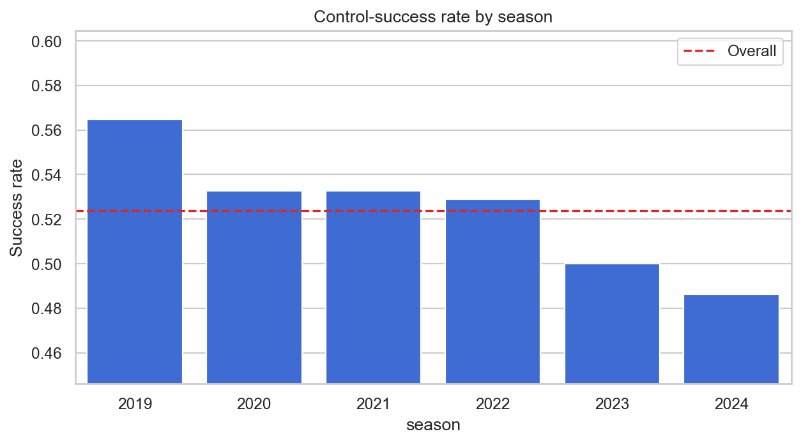
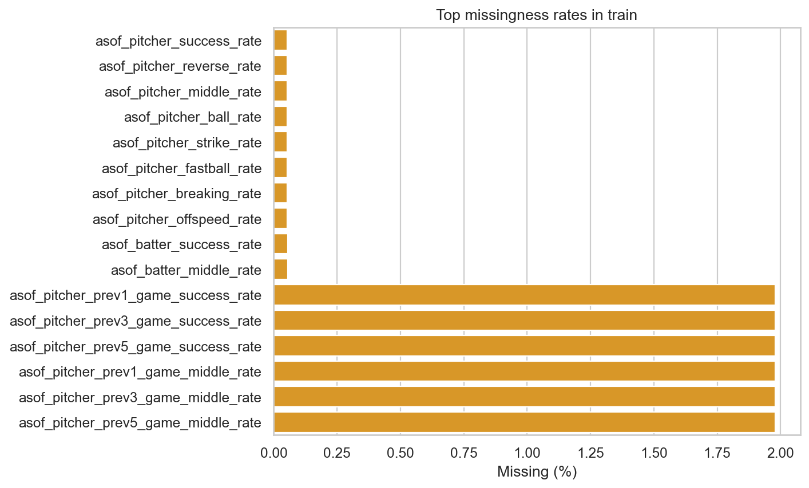
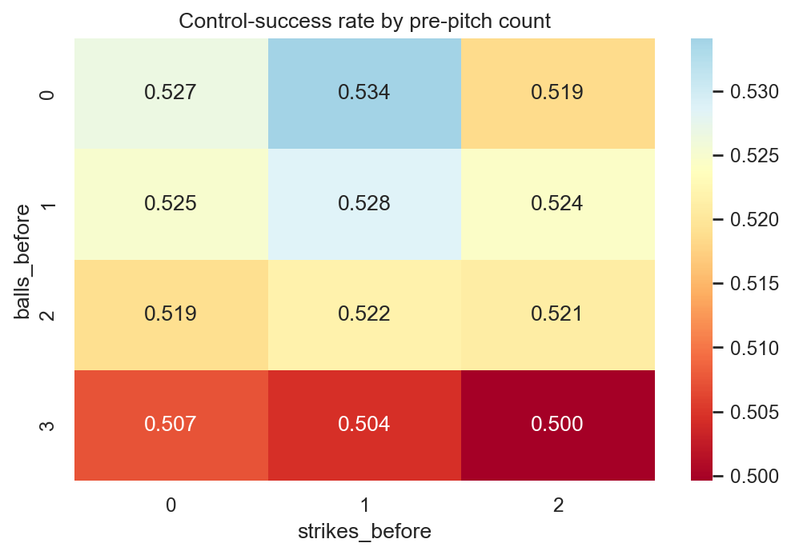
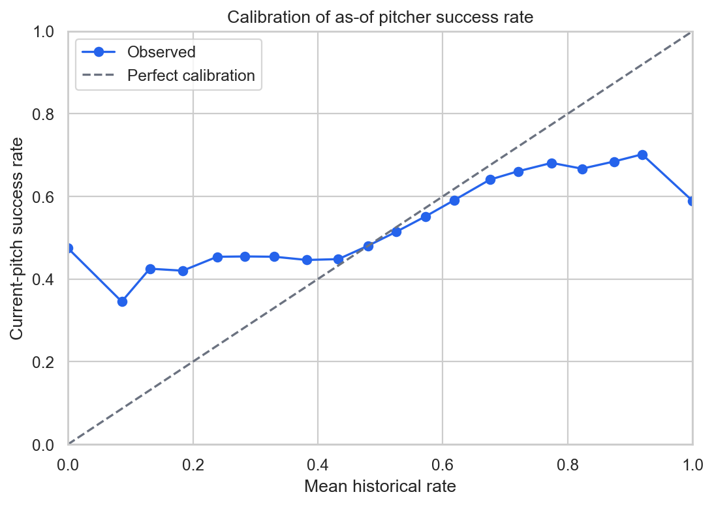
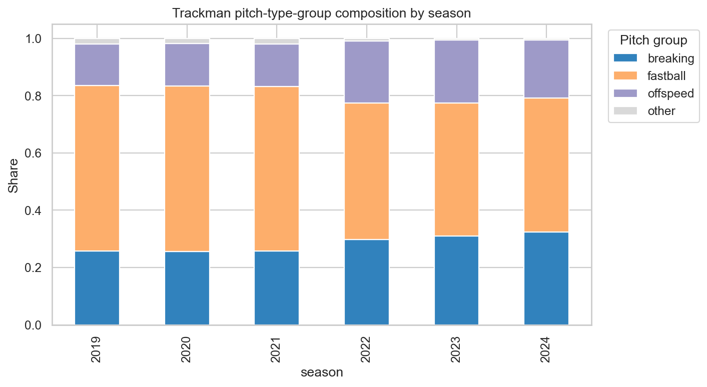
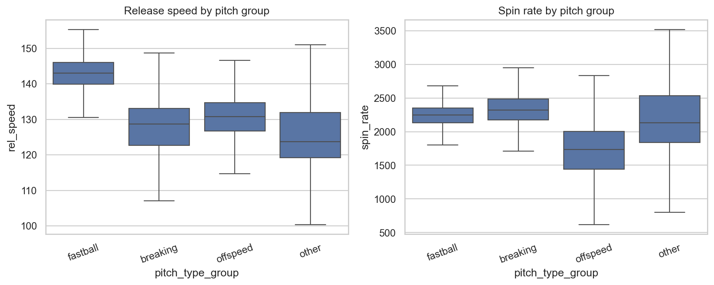

# Control Success 데이터 상세 EDA 보고서

분석 기준일: 2026-08-05  
분석 대상: `train.csv`, 형식 확인용 `test.csv`, `sample_submission.csv`, `trackman_history.csv`

## 0. 결론 먼저

이번 문제는 기존 CSW 예측 문제와 타깃 의미가 다르다. `control_success`는 현재 투구의 위치와 포수 요구 방향을 기준으로 산출된 제구 성공 여부이며, CSW처럼 현재 투구 결과를 뜻하지 않는다. 기존 CSW용 타깃 정의, 파생 변수 해석, 학습된 모델은 그대로 재사용하면 안 된다. 기존 파일은 건드리지 않았고, 본 EDA는 별도 폴더에서 새 타깃을 기준으로 수행했다.

가장 중요한 발견은 다음과 같다.

1. 전체 성공률은 **52.3766%**로 거의 균형이지만, 2019년 **56.4670%**에서 2024년 **48.6105%**로 **7.86%p 하락**했다. 단순 클래스 불균형보다 시간에 따른 타깃 분포 변화가 훨씬 큰 문제다.
2. `game_type`과 시즌의 상호작용이 매우 강하다. `F`의 성공률은 2022년 **70.8749%**에서 2023년 **47.2904%**로 급락했다. 코드 의미는 설명서에 공개되지 않았으므로 임의로 해석하지 않되, 모델과 검증에서 반드시 분리 확인해야 한다.
3. 동일 투수 중 양 시즌 모두 100구 이상인 집단에서도 2022→2023 성공률이 가중 평균 **2.61%p 하락**했다. 시즌 하락은 선수 구성 변화만으로 설명되지 않는다.
4. `row_id`는 사실상 시간 순서다. 더 심각하게는 같은 투수의 다음 학습 행에 있는 누적 성공률로 현재 타깃을 반올림 복원하면 **99.9463% 행에서 100% 정확히 복원**된다. 이는 데이터 구조 진단일 뿐이며, 테스트의 다른 행을 사용할 수 없으므로 절대 피처로 만들면 안 된다.
5. 제공된 `asof_pitcher_success_rate`는 단변량 AUC **0.5488**로 가장 유용한 단일 수치 피처지만, 극단값이 과도하게 확신적이고 최근 시즌에서 낙관 편향이 있다. 2024년 평균 과거 성공률은 실제보다 **2.53%p 높다**. 표본 수 기반 smoothing과 시즌별 재보정이 필요하다.
6. 메인 데이터와 Trackman의 선수 ID는 직접 겹치는 값이 **0개**다. 선수 단위 Trackman 결합은 검증된 crosswalk 없이는 불가능하다. 반면 공통 경기상황의 주변 분포는 매우 유사해 같은 경기 생태계를 다루는 보조 로그로 볼 근거는 충분하다.
7. Trackman은 매 시즌 메인 데이터보다 행이 많으며 비율이 2019년 **1.08배**에서 2024년 **1.32배**로 증가한다. 메인 데이터와 1:1 투구 테이블로 가정하면 안 된다.
8. 학습 행의 다음 누적값을 이용한 진단에서는 1,474,300행의 세부 실패 구조를 복원할 수 있었다. 전체 유효 행 기준 reverse **22.90%**, middle **14.96%**, far residual **13.17%**이며, reverse와 middle이 동시에 발생한 행이 **3.41%**라서 세 실패를 단순 상호배타 클래스로 보면 안 된다.
9. 시즌 최종 투구 수 100개 이하 투수는 시즌별 투수의 21.6~26.7%지만 전체 행의 1.43~1.94%만 차지한다. 다만 “해당 시즌 최종 100개 이하”는 시즌 종료 후에만 알 수 있으므로 EDA 태그로만 사용하고, 모델 입력에서는 현재까지의 `asof_pitcher_n`과 이전 완료 시즌 이력으로 대체해야 한다.



## 1. 데이터 규모와 스키마

| 파일 | 행 × 열 | 기간 | 핵심 용도 |
|---|---:|---|---|
| `train.csv` | 1,475,092 × 49 | 2019~2024 | 48개 입력 + `control_success` |
| `test.csv` | 5 × 48 | 2025 | 실제 평가 데이터가 아닌 형식 확인 샘플 |
| `sample_submission.csv` | 5 × 2 | 2025 | 제출 형식 확인 샘플 |
| `trackman_history.csv` | 1,793,078 × 30 | 2019~2024 | 과거 Trackman 보조 로그 |

학습 입력 48개와 테스트 48개 컬럼은 이름과 순서가 정확히 일치한다. 샘플 제출의 `row_id` 순서도 형식 확인용 테스트와 일치한다. 다만 테스트는 5행뿐이므로 결측률, 선수 커버리지, 범주 출현률, 분포 이동을 판단하는 용도로 사용하면 안 된다.

메인 입력은 다음과 같이 구성된다.

- 경기·식별 정보 7개
- 카운트·점수 정보 8개
- 주자·상황 중요도 정보 8개
- 선수·팀 정보 6개
- 투구 직전 과거 이력인 `asof_*` 19개

## 2. 타깃 분포와 시간 변화

성공은 772,603건, 실패는 702,489건이다. 전체 성공률은 52.3766%이므로 별도의 강한 class weight는 우선순위가 낮다.

| 시즌 | 행 수 | 성공률 | 전체 대비 |
|---:|---:|---:|---:|
| 2019 | 237,413 | 56.4670% | +4.09%p |
| 2020 | 244,087 | 53.2712% | +0.89%p |
| 2021 | 247,088 | 53.2762% | +0.90%p |
| 2022 | 247,472 | 52.8920% | +0.52%p |
| 2023 | 245,525 | 49.9957% | -2.38%p |
| 2024 | 253,507 | 48.6105% | -3.77%p |

### `game_type` 체제 변화

| 시즌 | F 표본 | F 성공률 | R 표본 | R 성공률 |
|---:|---:|---:|---:|---:|
| 2019 | 25,786 | 68.9250% | 211,627 | 54.9490% |
| 2020 | 23,213 | 58.7774% | 220,874 | 52.6925% |
| 2021 | 25,861 | 70.3840% | 221,227 | 51.2763% |
| 2022 | 30,448 | 70.8749% | 217,024 | 50.3691% |
| 2023 | 25,686 | 47.2904% | 219,839 | 50.3118% |
| 2024 | 30,010 | 45.9280% | 223,497 | 48.9707% |

2022→2023의 전체 하락은 `F`에서 특히 극단적이다. `R`도 2019 이후 하락하므로 변화가 `F`에만 국한되지는 않는다. 모델이 시즌과 `game_type`을 독립적인 범주로만 처리하면 이 비선형 변화를 놓칠 수 있다. `season × game_type` 상호작용과 유형별 보정 결과를 반드시 확인해야 한다.

### 동일 투수 추적 결과

양 시즌 모두 100구 이상인 동일 투수만 비교해도 다음 변화가 나타난다.

| 구간 | 비교 투수 | 중앙값 변화 | 현 시즌 투구 수 가중 변화 | 하락 투수 비율 |
|---|---:|---:|---:|---:|
| 2019→2020 | 180 | -3.54%p | -3.65%p | 81.7% |
| 2020→2021 | 206 | -0.02%p | 0.00%p | 50.0% |
| 2021→2022 | 193 | -0.15%p | -1.03%p | 54.4% |
| 2022→2023 | 202 | -2.67%p | -2.61%p | 75.2% |
| 2023→2024 | 196 | -0.76%p | -1.00%p | 58.7% |

따라서 시즌 변화는 신규 선수 유입만의 문제가 아니다. 라벨링 환경, 경기 유형 구성, 선수의 실제 제구 변화가 함께 반영된 것으로 봐야 한다.

## 3. 데이터 무결성과 중복 구조

메인 데이터에서 다음 항목은 모두 정상이다.

- `row_id` 결측·중복 0건, `TRAIN_<숫자>` 형식 준수
- 타깃은 0/1만 존재
- 볼 0~3, 스트라이크 0~2, 아웃 0~2 범위 위반 0건
- 주자 플래그 합과 `num_runners_on` 불일치 0건
- 주자 플래그와 `base_state` 불일치 0건
- 모든 `asof_*_rate`가 0~1 범위
- 모든 입력 피처가 완전히 같은 학습 행 0건

승률 기대값 합은 58,607행에서 정확히 100이 아니지만, 차이는 전부 **±0.1**이며 한 자리 소수 반올림으로 설명된다. 오류로 처리할 필요가 없다.

다음 피처는 결정론적으로 중복된다.

| 피처 | 다른 피처로부터의 계산 |
|---|---|
| `run_total_before` | `run_top_before + run_bot_before` |
| `score_diff_home` | `run_bot_before - run_top_before` |
| `score_diff_pitcher_team` | `score_diff_home`과 `top_bottom` |
| `num_runners_on` | 1·2·3루 주자 플래그 합 |
| `base_state` | 주자 플래그 조합 |
| `away_win_expectancy` | 대략 `100 - home_win_expectancy` |
| `asof_pitcher_pitchmix_n` | `asof_pitcher_n`과 전 행에서 동일 |

트리 모델은 중복을 어느 정도 감당하지만, 중요도 분산과 불필요한 복잡도를 줄이려면 대표 변수만 유지하는 ablation이 필요하다. 선형 모델에서는 다중공선성 때문에 더 적극적으로 정리해야 한다.

## 4. `row_id`와 미래 행 누수 위험

`row_id` 숫자 부분은 1부터 순증하고 시즌도 함께 단조 증가한다. 행 순서와 시즌 순위 상관은 **0.9860**이다. 또한 각 투수의 `asof_pitcher_n`은 해당 투수의 학습 데이터 누적 행 번호와 **100% 일치**한다.

같은 투수의 다음 학습 행에서

`다음 누적 성공 수 - 현재 누적 성공 수`

를 계산하고 반올림하면, 다음 행이 존재하는 **99.9463%**의 행에서 현재 `control_success`를 **100% 복원**할 수 있다. 제공률이 소수 6자리로 반올림되어 있어 복원값의 최대 반올림 오차는 0.0146이다.

이것은 현재 행의 입력 자체에 타깃이 들어 있다는 뜻은 아니다. 다음 행은 현재 투구 이후 정보이므로 다음과 같은 작업은 금지해야 한다.

- 전체 데이터를 먼저 정렬한 뒤 다음/이전 행 차분으로 현재 타깃 추정
- 테스트 행 순서로 rolling·expanding 집계
- 테스트 내 선수별 빈도나 누적값 계산
- 숫자형 `row_id`를 시간 대용 피처로 사용

`row_id`는 제출 매칭에만 사용하고 모델 입력에서는 제외하는 것이 안전하다. 검증도 무작위 분할이 아니라 과거 시즌→미래 시즌 순방향으로 해야 한다.

## 5. 결측과 cold start

메인 데이터의 결측은 전부 `asof_*`에 집중되어 있다.

| 결측 묶음 | 결측 행 | 비율 | 결측 시 성공률 | 존재 시 성공률 |
|---|---:|---:|---:|---:|
| 투수 누적률·구종 비율 | 792 | 0.0537% | 55.18% | 52.38% |
| 타자 누적률 | 830 | 0.0563% | 60.24% | 52.37% |
| 직전 1·3·5경기 6개 피처 | 29,185 | 1.9785% | 55.08% | 52.32% |

투수 누적률 결측 792건은 투수 고유 수 792명과 같고, 타자 누적률 결측 830건은 타자 고유 수 830명과 같다. 즉 각 선수의 첫 관측과 정확히 대응하는 cold start 구조다. 단순 평균 대체만 하지 말고 다음을 함께 사용해야 한다.

- `is_pitcher_cold_start`, `is_batter_cold_start`, `is_prev_game_history_missing`
- 표본 수 기반 Beta/Binomial smoothing 또는 전역·손잡이·유형별 prior
- 누적 표본 수의 `log1p` 변환
- 표본 수에 따라 누적률과 최근률을 혼합하는 신뢰도 가중치



## 6. 선수와 팀의 표본 구조

- 투수 792명, 타자 830명
- 팀 ID는 투수·타자 각각 13개
- 투수 상위 10명의 투구 비중 9.03%, 상위 50명 32.11%
- 100구 이상 투수 649명, 500구 이상 465명, 1,000구 이상 374명
- 500구 이상 투수의 성공률 중앙값 51.86%, 10~90분위 46.30~57.91%

연속 시즌 투수 유지율은 67.6~76.1%이고, 현 시즌 신규 투수 비율은 24.3~33.1%다. 선수 ID를 강하게 외우는 모델은 새 시즌에서 성능이 쉽게 무너진다. ID 피처를 쓰더라도 smoothing, 빈도 제한, out-of-fold encoding 또는 범주형 모델의 정규화가 필요하다.

주요 10개 팀은 각 13만~21만 행으로 충분하지만, 팀 22·23·25는 각각 676, 4,437, 292행뿐이다. 이 희소 팀들의 성공률은 42.47~69.23%여서 원시 target encoding은 매우 위험하다.

## 7. 상황별 타깃 패턴

아래 차이는 모두 단순 집계이며 시즌·`game_type`·선수 구성의 교란을 포함한다. 인과 효과로 해석하면 안 된다.

### 볼카운트



- 최고: 0-1, 53.41%
- 최저: 3-2, 49.96%
- 볼 3개 상태는 50.0~50.7%로 일관되게 낮다.
- 카운트 전체 최대 차이는 약 3.45%p로 유의미하지만 단독 예측력은 제한적이다.

### 손잡이 조합

| 투수-타자 코드 | 행 수 | 성공률 |
|---|---:|---:|
| 1v1 | 170,292 | 49.09% |
| 1v2 | 211,059 | 53.75% |
| 2v1 | 525,455 | 53.07% |
| 2v2 | 568,286 | 52.21% |

최대 차이는 4.66%p다. 개별 `pitcher_hand`, `batter_hand`보다 조합 피처가 더 유용하다.

### 이닝·레버리지·주자

- 1~3회 53.10% → 7~9회 51.56% → 연장 50.49%로 감소한다.
- 레버리지 1~2 구간이 52.90%로 가장 높고, 0.5 이하 51.69%, 3 초과 51.81%다. 단조 관계는 아니다.
- 만루는 51.61%, 3루만 주자는 53.61%지만 주자 상태 전체 차이는 약 2.0%p다.
- 3월 53.75%에서 10월 50.92%로 낮아진다. 시즌 내 피로뿐 아니라 경기 유형·일정·연도 구성의 영향을 함께 받는다.

## 8. `asof_*` 신호와 보정

30만 행 고정 표본에서 단변량 AUC가 높은 피처는 다음과 같다.

| 피처 | AUC | 방향 |
|---|---:|---|
| `asof_pitcher_success_rate` | 0.5487 | 높을수록 성공 증가 |
| `asof_pitcher_prev5_game_success_rate` | 0.5457 | 높을수록 성공 증가 |
| `asof_pitcher_reverse_rate` | 0.4546 | 높을수록 성공 감소 |
| `asof_pitcher_prev3_game_success_rate` | 0.5431 | 높을수록 성공 증가 |
| `asof_pitcher_prev1_game_success_rate` | 0.5373 | 높을수록 성공 증가 |
| `asof_batter_success_rate` | 0.5300 | 높을수록 성공 증가 |

누적 투수 성공률은 순위 신호는 있지만 확률 자체로는 잘 보정되지 않는다.

| 단순 예측값 | Brier | Log loss | AUC |
|---|---:|---:|---:|
| 전체 평균 0.5238 | 0.24944 | 0.69202 | 0.5000 |
| 투수 누적 성공률 | 0.24818 | 0.69570 | 0.5488 |

Brier는 소폭 좋아지지만 log loss는 오히려 악화된다. 특히 과거 성공률 0 또는 1은 작은 표본에서 발생하며 실제 현재 성공률은 각각 약 47.5%, 58.9%에 불과하다. 극단 확률을 그대로 쓰면 log loss에 큰 손해를 준다.

2024년에는 평균 누적 투수 성공률 51.14%에 비해 실제가 48.61%로 **2.53%p 낮다**. 2024 단독 AUC도 0.5342로 감소한다. 따라서 다음이 필요하다.

- 표본 수 기반 smoothing
- 확률 clipping
- 최근 3·5경기와 누적률의 신뢰도 가중 혼합
- 시즌 및 `game_type`별 calibration
- 최종 예측의 isotonic/Platt/Beta calibration 비교



## 9. Trackman 상세 EDA

Trackman은 2019-03-23부터 2024-10-17까지 1,793,078행이다. 투수 906명, 타자 913명, 팀 문자열은 투수·타자 각각 26개다. 팀 수가 메인 데이터보다 많은 이유에는 시즌별 명칭 변화와 특수·하위리그 코드가 섞여 있을 가능성이 있으므로 문자열을 그대로 프랜차이즈 ID로 가정하면 안 된다.

### 결측과 품질

물리 측정값의 결측률은 낮다.

| 피처 | 결측률 | 중앙값 | 1~99분위 |
|---|---:|---:|---:|
| `rel_speed` | 0.425% | 137.41 | 111.60~152.43 |
| `spin_rate` | 0.695% | 2,223 | 1,011~2,857 |
| `induced_vert_break` | 0.561% | 30.10 | -42.91~61.82 |
| `horz_break` | 0.576% | 12.99 | -45.27~55.09 |
| `extension` | 0.430% | 1.760 | 1.362~2.146 |
| `rel_height` | 0.425% | 1.761 | 0.605~2.023 |
| `zone_speed` | 0.442% | 125.92 | 102.29~139.38 |

예외는 극소수지만 집계 전에 정리할 필요가 있다.

- `(trackman_game_id, pitch_no)` 중복 2쌍, 관련 행 4건
- 잘못된 볼 4가 1건, 스트라이크 3이 1건
- `outs_before` 3 또는 4가 95건
- `inning=0`이 1건
- `extension` 최소 -0.387 등 일부 물리적으로 의심스러운 극단값

아웃 카운트 이상은 몇 개 경기에서 연속적으로 나타나 단순 랜덤 노이즈보다 원천 로그 오류 가능성이 높다. Trackman 집계 전에 유효 카운트 필터, 중복 제거, 물리 범위 clipping/winsorization을 적용해야 한다. 단, 낮은 릴리스 높이는 사이드암·언더핸드 투수일 수 있으므로 전역 IQR만으로 제거하면 안 된다.

### 구종 체계

`pitch_type_group`은 `auto_pitch_type`을 fastball/breaking/offspeed/other로 결정론적으로 단순화한 값이다. `tagged_pitch_type`과 `auto_pitch_type` 문자열의 정확 일치율은 55.1%지만, `Fastball` 대 `Four-Seam`, `ChangeUp` 대 `Changeup`처럼 명명 체계 차이가 크게 포함되어 있으므로 곧바로 품질 55%로 해석하면 안 된다. 모델링에는 제공된 `pitch_type_group`을 우선 사용하는 것이 안전하다.

fastball 비중은 2019~2021년 약 57.5%에서 2022~2024년 46.4~47.8%로 낮아지고, breaking은 25.8%에서 32.5%까지 높아진다. 2022년 전후의 큰 변화는 실제 구종 전략과 자동 분류 체계 변화가 섞였을 수 있으므로 연도별 표준화와 안정성 검사가 필요하다.





### 메인 데이터와의 연결 가능성

- 메인 `pitcher_id`와 `pitcher_trackman_id` 직접 교집합: **0명**
- 메인 `batter_id`와 `batter_trackman_id` 직접 교집합: **0명**
- 시즌별 Trackman/메인 행 비율: 1.08, 1.14, 1.22, 1.24, 1.28, 1.32
- 공통 상황 변수의 Jensen-Shannon divergence는 매우 작다. 예를 들어 초/말 평균 0.000003 bits, 볼카운트 0.000007 bits, 이닝 0.000115 bits다.

즉 두 파일의 상황 분포는 매우 비슷하지만, 제공 키만으로 선수 단위 직접 조인은 할 수 없다. 초기 팀 단위 분포 fingerprint는 여러 메인 팀에 동일 Trackman 팀이 최상위로 나올 정도로 모호했다. 이 단순 팀 후보를 실제 crosswalk로 사용하면 안 된다. 이후 월·요일·이닝·초말·카운트·상대 손잡이를 합친 **투수-시즌 상황 지문**으로 더 보수적인 실험 crosswalk를 만들었으며, 그 결과는 아래 후속 분석 절에 별도로 정리했다.

Trackman 활용의 안전한 순서는 다음과 같다.

1. 먼저 Trackman 없이 메인 데이터 베이스라인을 확립한다.
2. 명시적 crosswalk가 없으므로, 추정 crosswalk는 임계값 민감도와 미연결 fallback을 포함한 ablation에서만 사용한다.
3. 학습 행에는 해당 시점보다 과거 Trackman만 사용한다.
4. 메인 데이터에 정확한 경기 날짜가 없으므로 같은 시즌 월 단위 결합은 미래 정보 혼입 위험이 있다. 가장 보수적인 방법은 이전 시즌까지의 Trackman 집계만 쓰는 것이다.
5. 2025 테스트에는 2019~2024 Trackman 전체를 사용할 수 있지만, 동일한 규칙으로 학습 피처도 과거 정보만 사용해야 검증이 정직하다.

## 10. 세부 실패 구조 후속 분석

공개 입력에는 현재 투구의 reverse/middle/far 라벨이 직접 제공되지 않는다. 다만 학습 데이터에서 같은 투수의 다음 행은 현재 투구까지 반영된 누적률을 가지므로 아래 차분을 **학습 데이터 구조 진단과 보조 학습 라벨 실험에 한해** 계산할 수 있다.

```text
현재 사건 = 다음 누적 건수 × 다음 누적률 - 현재 누적 건수 × 현재 누적률
```

다음 행이 존재하고 누적 건수가 정확히 1 증가하며, 반올림 오차가 0.05 미만인 행만 유효로 처리했다.

| 항목 | 행 수 | 유효 행 비율 |
|---|---:|---:|
| 세부 라벨 복원 유효 행 | 1,474,300 | 99.9463% |
| 성공 | 772,140 | 52.3733% |
| 실패 | 702,160 | 47.6267% |
| reverse | 337,667 | 22.9035% |
| middle | 220,563 | 14.9605% |
| far residual | 194,196 | 13.1721% |
| reverse와 middle 동시 | 50,266 | 3.4095% |

복원한 success와 공개 `control_success`의 일치율은 유효 행에서 100%다. 이는 차분 계산 자체가 일관됨을 확인하는 검사이지, 미래 누적값을 입력 피처로 사용할 수 있다는 뜻이 아니다.

실패 702,160행을 중복 없이 나누면 다음과 같다.

| 실패 유형 | 행 수 | 전체 실패 내 비율 |
|---|---:|---:|
| reverse only | 287,401 | 40.93% |
| far residual | 194,196 | 27.66% |
| middle only | 170,297 | 24.25% |
| reverse & middle | 50,266 | 7.16% |

### 세 번째 실패 유형을 별도로 봐야 하는 이유

포수 요구 방향과 반대로 들어간 공은 위치 기반의 가운데·크게 벗어남과 성격이 다르다. 실제 집계에서도 reverse와 middle이 50,266행에서 동시에 나타난다. 따라서 세 라벨을 하나의 상호배타 3-class target으로 만들면 정보가 손실된다.

권장 표현은 다음 중 하나다.

- multi-label head: reverse, middle, far residual을 각각 예측
- 조건부 head: `reverse → middle | no reverse → far residual | neither`
- 공개 target만 직접 예측하는 direct head와 위 보조 head를 함께 학습

단, 다음 행의 누적률에서 공개되지 않은 세부 정답을 복원해 학습하는 행위가 대회 규정상 허용되는지는 운영진 답변 전까지 확정되지 않았다. 최종 제출에는 direct `control_success` 모델을 항상 유지하고, 세부 라벨 모델은 실험군으로 격리해야 한다.

## 11. 시즌 100구 이하 투수 분석

사용자가 정의한 “각 시즌 100개 이하 투수”를 시즌 최종 투구 수 기준으로 집계하면 다음과 같다.

| 시즌 | 전체 투수 | 100구 이하 투수 | 투수 비중 | 해당 행 수 | 행 비중 | 해당 집단 성공률 |
|---:|---:|---:|---:|---:|---:|---:|
| 2019 | 355 | 94 | 26.48% | 4,582 | 1.93% | 64.34% |
| 2020 | 356 | 77 | 21.63% | 3,493 | 1.43% | 56.08% |
| 2021 | 386 | 94 | 24.35% | 4,591 | 1.86% | 64.89% |
| 2022 | 390 | 103 | 26.41% | 4,665 | 1.89% | 64.48% |
| 2023 | 382 | 102 | 26.70% | 4,754 | 1.94% | 45.58% |
| 2024 | 391 | 94 | 24.04% | 4,574 | 1.80% | 45.34% |

이 집단의 성공률은 2022→2023에 약 18.9%p 급락한다. 표본이 매우 작고 시즌 체제 변화와 선수 구성 효과가 함께 들어 있으므로 “신인은 제구가 좋다/나쁘다”로 해석하면 안 된다. 대신 아래와 같이 처리한다.

- `same_season_final_n <= 100`은 EDA 및 사후 성능 slice에만 사용
- 입력 cohort는 현재 행의 `asof_pitcher_n`으로 `0`, `1~25`, `26~100`, `100 초과` 구분
- 이전 완료 시즌 중 100구 초과 시즌 존재 여부를 함께 사용
- 미연결 Trackman과 완전 신인은 손잡이·팀·cohort prior 또는 학습 가능한 fallback embedding 사용
- 작은 표본의 원시 성공률 대신 Beta smoothing과 표본 수 기반 shrinkage 사용

## 12. Main↔Trackman 추정 crosswalk 후속 분석

직접 ID 교집합은 여전히 0명이다. 이후 투수별 경기 상황 지문을 이용해 다음 조건의 실험 crosswalk를 만들었다.

- 같은 시즌과 같은 투수 손잡이 후보만 비교
- 월, 요일, 이닝, 초/말, 볼·스트라이크·아웃, 상대 타자 손잡이의 결합 빈도 사용
- cosine similarity 0.80 이상
- 2위 후보와의 margin 0.02 이상
- 한 Trackman ID에 복수 Main ID가 연결되면 신뢰도가 가장 높은 하나만 유지

| 지표 | 결과 |
|---|---:|
| 채택 Main 투수 | 419명 |
| 전체 792명 중 투수 수 커버리지 | 52.90% |
| 학습 행 커버리지 | 86.30% |
| 평균 매칭 시즌 수 | 2.43시즌 |
| 매칭 시즌 수 중앙값 | 2시즌 |
| 평균 cosine similarity | 0.9199 |
| cosine similarity 중앙값 | 0.9262 |
| 선택된 매핑의 고신뢰 시즌 간 일치율 | 100% |

이 결과는 직접 키나 공식 정답으로 검증된 crosswalk가 아니다. 상황 지문이 매우 유사한 투수를 잘못 연결할 가능성이 남아 있다. 따라서 다음 원칙이 필요하다.

- crosswalk 포함/제외 ablation을 동일 시간 fold에서 비교
- similarity, margin, 매칭 시즌 수를 신뢰도 피처로 함께 제공
- 고신뢰 연결만 Trackman 개인 피처를 사용하고 나머지는 cohort/global fallback
- 학습 시즌 `s`에는 `season < s`의 완료된 Trackman만 집계
- 2025 inference lookup은 2019~2024만 사용하고 test 행으로 crosswalk를 다시 만들지 않음

현재 생성된 OOF 투수-시즌 임베딩은 2,260개 `(pitcher_id, season)` 행, 48차원이다. 2021~2024는 이전 시즌만 학습한 OOF 임베딩을 사용할 수 있고, 2019~2020은 0 fallback과 availability flag를 사용한다. 이 임베딩은 단독 모델보다 CatBoost/LightGBM/XGBoost의 추가 피처 및 앙상블 후보로 우선 평가한다.

## 13. 권장 검증 설계

### 기본 검증

- Fold A: 2019~2021 학습 → 2022 검증
- Fold B: 2019~2022 학습 → 2023 검증
- Fold C: 2019~2023 학습 → 2024 검증
- 최종 선택은 2023·2024 성능에 더 큰 가중치를 둔다.

각 fold에서 전체 지표뿐 아니라 다음 slice를 별도로 기록해야 한다.

- `game_type` F/R
- cold-start 투수·타자
- 손잡이 조합
- 투수 과거 표본 수 구간
- 주요 10개 팀과 희소 팀
- 시즌 초/중/후반

확률 예측이므로 최소한 log loss, Brier score, ROC-AUC, calibration error와 보정 곡선을 함께 본다. AUC만 좋아지고 log loss가 나빠지는 모델은 대회 타깃인 성공 확률 예측에 적합하지 않을 수 있다.

### 금지해야 할 검증·피처

- 무작위 행 분할을 최종 성능으로 채택
- `row_id` 숫자 부분 사용
- 미래 행의 `asof_*` 차분
- 테스트 전체에서 계산한 빈도·선수 통계·월별 통계
- 테스트 행 순서 기반 rolling/expanding
- 2025 Trackman 또는 현재 투구 실제 구종·측정값 사용

## 14. 1차 모델링 우선순위

1. **누수 없는 메인 데이터 베이스라인**: `row_id` 제거, 순방향 시즌 검증, CatBoost/LightGBM 계열 비교.
2. **재보정 가능한 과거 이력 피처**: 누적 성공률, 최근 3·5경기 성공률, reverse/middle rate, 표본 수와 결측 플래그.
3. **체제 변화 피처**: `season × game_type`, 최근 시즌 가중치, 시즌별 calibration.
4. **상황 상호작용**: 볼-스트라이크 조합, 투수-타자 손잡이 조합, 이닝 구간, 점수 차와 레버리지.
5. **고카디널리티 정규화**: 투수·타자 ID의 smoothing/OOF 처리와 신규 선수 fallback.
6. **Trackman은 후순위**: 추정 crosswalk의 신뢰도 임계값과 미연결 fallback을 검증하고, 이전 완료 시즌 집계부터 작은 ablation으로 추가.
7. **세부 실패 구조는 별도 실험**: reverse/middle의 중복을 유지하는 multi-label 또는 조건부 head를 사용하되, 운영진 허용 전에는 direct target 모델과 분리.

## 15. 산출물 안내

- 재현 스크립트: `run_eda.py`
- 핵심 표·검사 결과: `outputs/*.csv`, `outputs/*.json`
- 시각화: `outputs/*.png`
- 시간 OOF 임베딩: `../pitcher_embedding/outputs/pitcher_season_embedding_oof.parquet`
- 2025 frozen lookup: `../pitcher_embedding/outputs/pitcher_embedding_lookup_2025.parquet`
- 추정 crosswalk: `../pitcher_embedding/outputs/main_trackman_pitcher_crosswalk.parquet`

원본 파일은 수정하지 않았으며, 이 보고서의 모든 수치는 스크립트를 다시 실행해 재현할 수 있다.
