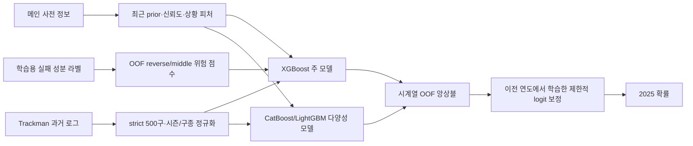

# 인사이트 기반 모델링 계획

작성일: 2026-08-06  
목표: 2025 `control_success` 확률의 Brier Score 최소화 및 최종 제출 2개 선정

관련 분석: `DATA_FEATURE_INSIGHTS.md`

## 0. 현재 기준과 목표

| 항목 | 현재 값 |
|---|---:|
| Public LB 최고 | XGBoost V1 873.0751 |
| 2024 고정 단일 모델 최고 | V2R200 + strict TM500, BSS 769.6874 |
| V1 OOF 앙상블 | BSS 789.6734 |
| 리더보드 1위 참고 | 약 1100 |

현재 모델의 한계는 단순 모델 용량이 아니다.

1. 2019→2024 타깃 기준선이 7.86%p 이동했다.
2. 2023년 `game_type=F`와 reverse 실패에 구조적 단절이 있다.
3. 누적률은 오래된 시즌을 포함해 최근 확률을 과대평가한다.
4. Trackman은 2022년 측정·분류 체계 변화와 가용 집단 선택 편향이 있다.
5. 최고 모델도 2024 평균 확률이 0.756%p 높아 calibration 손실이 크다.

따라서 다음 모델은 `더 많은 피처`가 아니라 `최근성·신뢰도·실패 원인·측정 체계·확률 보정`을 명시적으로 처리한다.

## 1. 전체 구조

최종 모델은 다음 네 층으로 구성한다.

- 기본층: 원본 48개 피처 + 검증된 V1 파생 피처
- 신뢰도층: 최근 기준으로 재보정된 `asof_*`, 표본 신뢰도, 비대칭 momentum
- 보조층: strict Trackman 저차원 요약/임베딩과 OOF 실패 위험도
- 출력층: 서로 다른 모델의 OOF 앙상블 + 시간 순서가 지켜진 작은 확률 보정

## 2. 절대 변경하지 않는 검증 규칙

| Fold | 메인 학습 | 메인 검증 | 사용할 수 있는 Trackman |
|---|---|---|---|
| F22 | 2019~2021 | 2022 | 2019~2021 |
| F23 | 2019~2022 | 2023 | 2019~2022 |
| F24 | 2019~2023 | 2024 | 2019~2023 |
| Final | 2019~2024 | 2025 | 2019~2024 |

추가 규칙:

- Trackman 개별 투수-시즌 통계와 임베딩은 해당 시즌 500구 이상만 사용한다.
- 테스트 행은 독립이므로 테스트 내부 정렬·rolling·선수별 집계를 하지 않는다.
- 학습용 reverse/middle 라벨은 보조 정답으로만 사용한다. 원래 값이나 다음 행 차분을 입력 피처로 넣지 않는다.
- feature ablation은 같은 데이터, 같은 seed, 같은 고정 모델 파라미터로 비교한다.
- BSS의 `max(0, ...)`를 Optuna 목적함수로 쓰지 않고 normalized Brier를 최소화한다.

### Optuna 목적함수

기본 목적함수:

`J = 0.10 × NB22 + 0.25 × NB23 + 0.65 × NB24`

여기서 `NB = Brier / (r × (1-r))`이다. 2025와 가장 가까운 F24를 가장 크게 보되, 2023 단절에서 완전히 무너지는 설정은 제한한다.

동점 우선순위:

1. F24 Brier
2. F24 예측 평균 오차 절댓값
3. F23 normalized Brier
4. 모델 수와 추론 시간

## 3. Phase A — 누적률을 최근 기준으로 재보정

가장 먼저 실행할 핵심 피처다. 현재 smoothing 200이 검증됐지만 prior가 고정되어 있고 베테랑 누적률의 과거 편향을 제거하지 못한다.

### A1. 직전 시즌 calibration shift

각 fold의 target 시즌을 `S`라고 할 때, `S-1`까지만 사용해 다음을 계산한다.

`gap_component = actual_rate_(S-1) - mean_asof_rate_(S-1)`

`adjusted_rate = sigmoid(logit(asof_rate) + logit_shift_component)`

대상 성분:

- pitcher success, reverse, middle, ball, strike
- batter success, middle
- fastball, breaking, offspeed

비교 방식:

- 원본 누적률
- additive shift
- logit shift
- 최근 2개 시즌 gap의 지수가중 평균
- 최근 gap의 선형 추세를 제한 범위 안에서 외삽

2024 검증에서는 2023 gap만 사용하고, Final 2025에서는 2024 gap을 사용한다.

### A2. 성분별 동적 prior와 shrinkage

현재 모든 성분에 사실상 고정 prior를 사용하는 대신 다음 후보를 비교한다.

- `fixed`: 현재 prior
- `last`: 직전 시즌 실제 성분 평균
- `ewm1`: half-life 1년
- `ewm2`: half-life 2년
- `trend`: 최근 3개 시즌 가중 추세, ±3%p 이내 clipping

Shrinkage 강도 후보:

- 공통: 100, 150, 200, 250, 300
- success/reverse/middle과 pitchmix의 강도를 따로 두는 2단계 탐색

핵심 공식:

`smoothed = (rate × n + prior × k) / (n + k)`

함께 유지할 피처:

- `n/(n+k)` 신뢰도
- `log1p(n)`
- `n <= 25/100/500/1000`
- cold-start 및 결측 플래그

### A3. 베테랑 누적률의 오래된 이력 보정

`asof_pitcher_n > 1000`에서 누적률이 실제보다 평균 1.49%p 높았다. 다음 피처를 비교한다.

- recent-adjusted rate와 raw rate의 차이
- `adjusted_rate × reliability`
- `adjusted_rate + season_gap_correction × reliability`
- 표본 구간과 adjusted rate 상호작용

### A 단계 채택 조건

- 고정 XGBoost에서 F24 BSS +3 이상, 또는
- F24 +1 이상이면서 F23 normalized Brier 개선, 또는
- 단독 개선은 작아도 기존 모델과 예측 상관 <0.985이고 앙상블 BSS +1 이상

## 4. Phase B — 최근 1·3·5경기 비대칭 momentum

최근 5경기와 누적률의 차이는 상·하위에서 강하지만 중앙은 비선형이다. 다음 피처를 만든다.

### B1. 방향 분리

- `momentum_pos = max(delta, 0)`
- `slump_neg = max(-delta, 0)`
- 1·3·5경기별 success와 middle 각각 생성
- 1·3·5 delta의 부호 일치 개수

### B2. 안정성

- delta 중앙값, 최솟값, 최댓값, 범위, 표준편차
- 최근 1→3→5의 단순 기울기
- 최근 성공과 middle 변화 방향이 동시에 나빠지는지 여부
- 최근 이력 결측과 복귀/신인 플래그

### B3. 표본 신뢰도

- 최근 delta를 `asof_pitcher_n`으로 shrink
- delta를 전체 분위 rank로 변환하지 않고, 과거 데이터로 만든 고정 분위 경계 사용
- 1~99% 또는 2~98% winsorization 비교

실험은 `A + B1`, `A + B1+B2`, `A + B 전체` 순서로 진행한다. 한 번에 전부 넣지 않는다.

## 5. Phase C — 3가지 실패 원인의 보조 모델

reverse의 단일 누적률 AUC가 0.5733으로 가장 높으므로 우선순위를 둔다.

### C1. 별도 binary OOF 위험 모델

각 fold에서 다음 모델을 과거 시즌으로만 학습한다.

- `P(reverse)`
- `P(middle)`
- `P(outside_only)`

주 모델에는 검증·학습 모두 OOF 방식으로 생성된 다음 값만 넣는다.

- 세 위험 확률
- reverse + middle union 근사값
- `P(reverse) - P(middle)`
- 실패 모델 entropy 또는 확신도

먼저 XGBoost 3개를 얕게 학습한다. outside-only가 계속 AUC 0.52 미만이면 제외한다.

### C2. shared-trunk multi-head 신경망

두 번째 후보로 작은 MLP/Tabular network를 사용한다.

- 공통 trunk
- main success, reverse, middle, outside 네 개의 sigmoid head
- main loss 가중치 1.0
- reverse 0.3, middle 0.2, outside 0.1부터 탐색
- embedding/hidden size 16·32·64, dropout 0.0~0.3

다중분류 softmax로 success를 대체하지 않는다. 최종 success는 독립 head로 유지한다.

### C3. F 전용 상호작용

- `P(reverse) × is_F`
- `asof_reverse_adjusted × is_F`
- `P(reverse) × full_count`

F 전용 별도 모델은 만들지 않는다. 표본을 나누지 않고 한 모델에서 상호작용만 학습한다.

### C 단계 채택 조건

- 주 모델 단독 BSS +2 이상, 또는
- 기존 주 모델과 블렌드 시 F24 +2 이상
- 실제 보조 라벨을 직접 넣지 않았는지 OOF audit 통과
- F23→F24에서 같은 방향으로 효과 확인

## 6. Phase D — 상황별 drift와 제한된 상호작용

full count, F, 손 조합에서 과대 예측이 집중되지만 전체 target encoding은 실패했다. 저차원 피처만 사용한다.

후보:

- `is_F`, `balls_eq_3`, `two_strike`, `full_count`
- `F × adjusted_reverse`
- `full_count × adjusted_success`
- `hand_matchup × adjusted_reverse/middle`
- `late_inning × LI bucket × score_abs bucket`
- `runner_out_state`, 단 희소 조합은 상위 상태로 묶음

사용하지 않을 것:

- 투수·타자·팀·상황을 조합한 대규모 target encoding
- 현재 시즌 정답을 이용한 범주 평균
- 희소한 `pitcher × count × game_type` 원시 조합

## 7. Phase E — Trackman 안정화와 투수 임베딩

### E1. strict 500구 규칙

- 투수-시즌 500구 이상만 개별 통계와 임베딩 생성
- 500구 미만은 모두 `unknown/new` 공통 표현
- target 시즌보다 작은 시즌만 사용
- 2024 검증에서 2024 Trackman은 crosswalk에도 사용하지 않음

### E2. 시즌·구종 기준 정규화

2022년 측정 체계 단절을 완화하기 위해 각 Trackman 시즌과 pitch group 안에서 다음을 계산한다.

- median과 IQR 기반 robust z-score
- 5~95% winsorized z-score
- 리그·구종 평균 대비 투수 편차

대상:

- rel_speed, spin_rate
- induced_vert_break, horz_break
- extension, rel_height, rel_side
- zone_speed

구종 비율은 fastball·breaking·offspeed 3개를 모두 그대로 쓰지 않는다.

- fastball 대 비-fastball log-ratio
- breaking 대 offspeed log-ratio
- 작은 epsilon을 둔 CLR 2차원 표현

### E3. 저차원 요약

- 최신 eligible 시즌
- 최근 2개 eligible 시즌 지수가중 평균
- 최신-이전 변화량
- 시즌 간 변동성
- season gap, eligible 시즌 수, 총 투구 수
- crosswalk match seasons, similarity, margin

세부 구종별 수백 피처를 직접 붙이지 않는다.

### E4. 임베딩 후보

| 후보 | 차원 | 입력 | 목적 |
|---|---:|---|---|
| PCA/SVD | 8·16·32 | 정규화된 투수-시즌 프로필 | 안정적 저차원 기준 |
| Denoising autoencoder | 8·16·32 | 마스킹된 프로필 복원 | 비선형 물리 특성 압축 |
| Multitask embedding | 16·32·64 | Trackman 프로필 + 과거 main 보조타깃 | 실패 성향 표현 |

64차원은 성능이 확인될 때만 유지한다. compact Trackman이 전체 피처와 거의 같았던 점을 고려하면 8·16·32를 우선한다.

### E 단계 채택 조건

- raw TM500 기준 BSS 769.69 대비 +2 이상, 또는
- 단독 성능이 같아도 기존 Trackman 모델과 상관 <0.985이고 앙상블 +1.5 이상
- 가용/미가용 각각의 Brier가 모두 악화되지 않음
- 추론 시 외부 다운로드와 원시 Trackman 재집계가 필요 없도록 lookup/embedding을 모델 폴더에 저장

## 8. Phase F — 모델군과 Optuna 방향

피처 선택을 먼저 끝낸 뒤 모델별 탐색을 한다. 피처와 하이퍼파라미터를 동시에 크게 바꾸지 않는다.

### F1. XGBoost 주 모델

두 개의 탐색 공간을 운영한다.

1. 현재 trial 24 주변 local search
2. 최근 fold 중심의 넓은 search

주요 범위:

- learning rate 0.003~0.05
- max depth 4~9
- max leaves 16~96
- min child weight 100~1,500
- subsample 0.75~1.0
- colsample 0.50~0.90
- reg lambda 1~100, reg alpha 1e-6~10
- max bin 128·256
- 최대 5,000 trees + early stopping

권장 trial: local 150, broad recent 200. 상위 10개는 seed 3개로 재검증한다.

### F2. CatBoost 다양성 모델

- depth 5~9
- learning rate 0.01~0.08
- l2 leaf reg 3~100
- random strength 0.05~5
- bagging temperature 0~3
- border count 64·128·254

권장 trial: 120. 단독 최고보다 XGBoost 잔차와의 낮은 상관을 함께 본다.

### F3. LightGBM 보조 모델

- num leaves 15~95
- min data in leaf 300~5,000
- feature/bagging fraction 0.65~1.0
- lambda L1/L2 탐색

권장 trial: 100. F24 성능과 잔차 다양성이 모두 낮으면 이후 앙상블에서 제거한다.

### F4. 신경망

다중 헤드 또는 Trackman 임베딩 결합에만 사용한다. 원본 테이블 전체를 큰 Transformer로 학습하는 실험은 후순위다.

## 9. Phase G — 시간 순서 확률 보정

2024 정답에 직접 맞춘 oracle 보정은 제출에 사용할 수 없다. 다음 전이 검증만 허용한다.

1. 2019~2022로 모델 학습 → 2023 OOF 예측 생성
2. 2023 OOF에서 보정기 학습
3. 2019~2023 모델의 2024 예측에 보정기 적용
4. 2024에서 개선 확인
5. Final에서는 2024 OOF에서 보정기를 학습해 2025 예측에 적용

보정 후보:

- global logit offset
- ridge Platt: `a × logit(p) + b`
- global + F offset
- global + F + full-count offset
- global + hand-matchup offset

그룹 offset은 L2 또는 empirical-Bayes shrinkage를 강하게 적용한다. isotonic과 수십 개 그룹 보정은 사용하지 않는다.

채택 조건:

- 2023에서 학습한 보정기가 2024 Brier를 실제로 개선
- AUC 손실 없음
- F와 R 모두 Brier 악화 없음, 또는 전체 개선이 충분하고 악화 폭이 매우 작음
- 보정 후 평균 예측이 과도하게 0.5로 수축하지 않음

## 10. Phase H — OOF 앙상블

후보군:

- XGB adaptive-prior 주 모델 seed 3개
- XGB + normalized Trackman/embedding
- CatBoost 다양성 모델 1~2개
- reverse auxiliary/stack 모델
- LightGBM은 잔차 다양성이 있을 때만 포함

앙상블 선택:

- 확률 공간 convex weight
- logit 공간 convex weight
- nonnegative weights, 합 1
- L2 1e-5~1e-2
- F22/F23에서 weight를 학습해 다음 fold에 적용하는 전이 검증
- family 하나의 총 weight가 70%를 넘지 않는 제약도 비교

모델 수는 최대 6개를 원칙으로 한다. 성능 차이가 1 BSS 미만이면 더 작은 앙상블을 선택한다.

## 11. 실험 채택·중단 기준

### 채택

- F24 BSS +3 이상: 단독 채택 후보
- F24 +1~3이며 F23도 개선: 안정형 후보
- 단독 성능 동일, 잔차 상관 <0.985, 앙상블 +1 이상: 다양성 후보
- 성능이 재실행 seed 3개 중 2개 이상에서 유지

### 중단

- F24 BSS -5 이하이며 잔차 다양성도 없음
- F23 normalized Brier가 0.0015 이상 악화하고 F24 개선이 +8 미만
- Trackman 가용/미가용 중 한 집단이 크게 악화
- 최종 추론 예상 시간이 8분을 넘거나 RAM 24GB를 넘음
- 미래 시즌 정보 또는 테스트 행 간 정보 사용 가능성이 있음

모든 실패 실험도 `validation_registry.csv`에 남긴다.

## 12. 실행 순서

| 순서 | 작업 | 예상 실험 수 | 산출물 |
|---:|---|---:|---|
| 1 | 현재 실행 중 recent/local XGB, LGBM, Cat, embedding 대조군 완료 | 기존 queue | baseline registry |
| 2 | A: 최근 calibration shift와 동적 prior | 20~35 | adaptive-prior 캐시·ablation |
| 3 | B: 비대칭 momentum | 8~12 | momentum ablation |
| 4 | C: reverse/middle OOF 위험 모델 | 12~20 | component OOF predictions |
| 5 | D: 제한된 상황 상호작용 | 8~12 | context ablation |
| 6 | E: Trackman 정규화·8/16/32 임베딩 | 15~25 | strict lookup·embedding |
| 7 | F: 선택 피처로 모델별 Optuna | 450~570 trials | persistent DB·top trials |
| 8 | G: 시간 전이 calibration | 10~20 | calibration audit |
| 9 | H: seed OOF와 앙상블 | 30~60 조합 | ensemble selection |
| 10 | 2019~2024 전체 재학습 및 로컬 제출환경 검증 | 최종 2개 | submit ZIP 2개 |

기존 queue가 만드는 최종 ZIP은 중간 대조군으로 보존한다. 인사이트 실험이 끝나기 전에는 최종 제출 2개로 확정하지 않는다.

## 13. 최종 제출 2개 설계

### 제출 A — 최대 성능형

- adaptive-prior + momentum + normalized Trackman
- XGBoost seed ensemble
- CatBoost 및 reverse auxiliary 모델 중 OOF 최적 조합
- 전이 검증을 통과한 계층적 logit 보정

### 제출 B — 안정·다양성형

- adaptive-prior + compact/latest Trackman
- XGBoost + CatBoost 소수 모델
- 보정은 global offset만 사용하거나, 전이 검증이 불안정하면 무보정
- 제출 A와 예측 상관이 낮은 후보를 선택

두 파일 모두 다음을 통과해야 한다.

- ZIP 최상위에 `model/`, `script.py`, `requirements.txt`
- 파일명 30자 이하: 날짜 폴더 안 `submit_{회수}.zip`
- `/app` 고정값이 아니라 `Path(__file__).resolve().parent` 기준 경로
- 모델 파일 존재 사전 점검
- test 245,789행 추론 8분 이내 목표
- RAM 24GB 이하, 오프라인 실행, `output/submission.csv` 생성
- 확률 finite, 0~1, row 순서와 row_id 완전 일치

## 14. 가장 먼저 실행할 실험 5개

1. `asof success/reverse/middle`에 직전 시즌 logit gap을 적용한 고정 모델
2. 성분별 recent EWM prior + smoothing 150/200/250
3. positive momentum과 negative slump 분리 ablation
4. reverse binary OOF 위험 점수를 추가한 주 모델
5. Trackman 시즌·구종 robust z-score compact 모델

이 다섯 개로 인사이트의 실제 점수 기여를 분리한 뒤, 승자 조합에만 대규모 Optuna를 적용한다.
