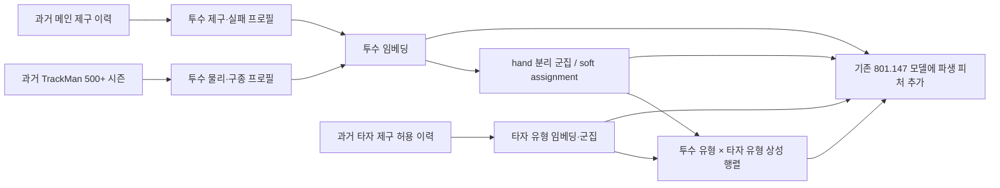

# 투수 임베딩·클러스터링 및 투수 유형 × 타자 유형 상성 모델 계획

작성일: 2026-08-12  
목표: 2025 `control_success` 확률 예측의 Brier Score 개선  
현재 비교 기준: 2024 고정 검증 최고 BSS 801.1471, Public LB 최고 873.0751

## 실행 완료 현황

| 단계 | 상태 | 최고 결과 |
|---|---|---|
| 투수 프로필·TrackMan 500구 감사 | 완료 | cutoff 2020~2025, 286열 |
| 투수 K/알고리즘 탐색 | 완료 | combined PCA8 diagonal GMM, 좌 2/우 4 |
| 군집 피처 직접 투입 | 완료 | hard/soft ID는 성능 악화 |
| 성공률 투수×타자 상성 | 완료 | 2024 혼합 BSS 806.4875 |
| 3번 reverse 독립 상성 | 완료 | 상황 평균 제거 후 두 fold 개선 |
| reverse 전용 타자 K 탐색 | 완료 | KMeans 좌 4/우 6 |
| KMeans seed 안정화 | 완료 | seed 17/2026/4099 correction 평균 |
| 최종 패키징 | 완료 | `submit_013.zip`, 2024 BSS **812.7040** |

상세 실험 결과와 제출 우선순위는 `pitcher_cluster_matchup/RESULTS.md`에 기록한다.

## 1. 결론

이 아이디어는 실험 가치가 높다. 다만 단순히 `pitcher_cluster_id` 하나를 모델에 추가하는 방식으로는 정보 손실이 크다. 다음 네 종류를 함께 만들어야 한다.

1. 투수의 연속 임베딩 `z_pitcher`
2. 투수 군집의 hard ID와 soft 소속확률 `q_pitcher`
3. 타자 유형의 임베딩·군집 `z_batter`, `q_batter`
4. 과거 시즌에서 계산한 `투수 유형 × 타자 유형` 제구 성공 잔차와 신뢰도

가장 안전한 시작은 **임베딩을 먼저 만든 뒤 클러스터링하는 2단계 방식**이다. 이 결과가 유효하면 임베딩과 군집 중심을 함께 학습하는 joint prototype 모델로 확장한다.

여기서 “강하다/약하다”는 타격 결과나 실점 억제력이 아니다. 이 대회의 목적에 맞게 다음처럼 정의한다.

> 동일한 경기 상황과 선수 기본 확률을 통제한 뒤, 특정 투수 유형이 특정 타자 유형을 만났을 때 `control_success` 확률이 기준보다 높거나 낮은 정도

## 2. 데이터 규모와 설계에 미치는 영향

### 메인 데이터

| 구분 | 값 |
|---|---:|
| 전체 행 | 1,475,092 |
| 전체 투수 | 792 |
| 전체 타자 | 830 |
| 시즌별 투수 | 355~391 |
| 시즌별 타자 | 371~424 |
| 2024 제구 성공률 | 48.61% |

2024 시즌에는 투수 hand 코드 1이 103명, 코드 2가 292명이다. 타자 hand 코드 1은 174명, 코드 2는 262명이다. `1/2`가 실제 좌/우 중 어느 쪽인지 코드에서 임의로 가정하지 않고 데이터 설명과 TrackMan 대응을 먼저 검증한다.

### TrackMan 500구 조건

| cutoff | 해당 시즌 예측에서 사용 가능한 최근 TrackMan | 메인 투수 중 매칭·사용 가능 | hand 1 | hand 2 |
|---:|---|---:|---:|---:|
| 2023 | 2022까지 | 176 | 45 | 131 |
| 2024 | 2023까지 | 169 | 40 | 129 |
| 2025 | 2024까지 | 210 | 51 | 159 |

- TrackMan 물리 임베딩에는 **투수-시즌별 500구 이상인 시즌만** 넣는다.
- 2024 검증에는 2024 TrackMan을 절대 쓰지 않는다.
- 500구 미만 시즌을 여러 시즌 합쳐 500구로 만드는 방식도 사용하지 않는다.
- 표본이 작은 hand 1은 큰 K에서 군집이 불안정할 수 있으므로 hand별 K 상한을 다르게 둔다.

## 3. 전체 구조



## 4. 시간 누수 방지 원칙

모든 임베딩, scaler, PCA, 군집 중심, 타자 유형, 상성 통계는 fold별로 다시 학습한다.

| Fold | 메인 학습·통계 | 검증 | 사용 가능한 TrackMan |
|---|---|---|---|
| F22 | 2019~2021 | 2022 | 2019~2021 중 시즌 500구 이상 |
| F23 | 2019~2022 | 2023 | 2019~2022 중 시즌 500구 이상 |
| F24 | 2019~2023 | 2024 | 2019~2023 중 시즌 500구 이상 |
| Final | 2019~2024 | 2025 | 2019~2024 중 시즌 500구 이상 |

추가 원칙:

- 시즌 S의 모든 행에 붙는 군집과 상성 통계는 S-1까지의 자료로만 만든다.
- 메인 데이터에는 정확한 경기 날짜가 없으므로, 안전성을 위해 같은 시즌 내부 target 누적 통계는 만들지 않는다.
- test 전체의 빈도·평균·분포·선수 목록을 사용해 군집을 다시 맞추지 않는다.
- 과거 행의 잔차를 만들 때 사용하는 기본 예측도 in-sample 예측이 아니라 시간 OOF 예측을 사용한다.
- 군집 번호 자체는 fold마다 의미가 바뀔 수 있다. 검증·최종 모델은 각 fold의 frozen lookup을 사용하며, 번호 정렬은 centroid 특성 기준으로만 수행한다.

## 5. 투수 프로필 구성

클러스터링 단위는 투구 행이 아니라 `(pitcher_id, cutoff season)` 프로필이다. 한 투수가 많이 던졌다고 군집 중심을 과도하게 끌지 않도록 기본 학습 가중치는 투수별 동일 가중치를 사용한다.

### 5.1 물리·구종 피처

TrackMan 500구 이상 시즌에서 다음을 사용한다.

- 구속: `rel_speed`, `zone_speed`
- 회전: `spin_rate`
- 무브먼트: `induced_vert_break`, `horz_break`
- 릴리스: `extension`, `rel_height`, `rel_side`
- 구종 구성: fastball/breaking/offspeed/other 비율, entropy, HHI
- 구종별 물리 특성: 구종군별 평균·표준편차
- 구종 분리도: fastball-minus-breaking, fastball-minus-offspeed의 구속·회전·무브먼트 차이
- 시간 변화: 최신 eligible 시즌, 최근 2개 시즌 EWM, 최신-과거 차이, 시즌 간 변동성

연도별 측정 체계 drift를 줄이기 위해 각 `season × pitch_type_group` 안에서 median/IQR robust z-score를 만든다. 좌투수와 우투수의 수평 무브먼트 및 release side 방향은 **arm-side 기준으로 부호를 정규화한 버전**과 원본 버전을 모두 비교한다.

### 5.2 제구·실패 성향 피처

해당 cutoff 이전 메인 이력에서 다음을 pitcher-season 단위로 요약한다.

- adjusted success rate와 신뢰도
- reverse, middle, outside-only 성향
- ball/strike rate
- 최근 1·3·5경기와 장기 평균 차이
- full count, two-strike, 주자 있음, 높은 LI 등 압박 상황의 **기준 대비 잔차**
- batter hand별 성공 잔차
- 시즌 간 평균, 최근 가중평균, 추세, 변동성

절대 성공률은 시즌 drift를 강하게 받으므로 원시 성공률보다 `해당 시즌 리그 평균 대비 차이`, `기존 기본 모델 OOF 잔차`를 우선 사용한다.

### 5.3 표본·결측 피처

- eligible TrackMan 시즌 수
- 총 eligible TrackMan 투구 수
- 최신 TrackMan 시즌과 cutoff의 간격
- main 누적 투구 수와 직전 시즌 투구 수
- TrackMan 매칭 신뢰도
- 각 구종군 표본 수

결측은 중앙값 하나로 덮고 끝내지 않는다. 결측값 대체값과 함께 `available`, `season_gap`, `reliability`를 반드시 넣는다.

## 6. 신인·저표본·TrackMan 미보유 투수 처리

서로 다른 상황을 하나의 unknown으로 합치지 않는다.

| cohort | 조건 | 처리 |
|---|---|---|
| TM-eligible | 과거 eligible 시즌이 하나 이상 | 물리+제구 임베딩 및 군집 |
| control-only | TrackMan 500+ 없음, main 과거 표본 충분 | 제구 전용 임베딩·군집, 물리 soft assignment는 전체 평균으로 shrink |
| rookie | 직전 시즌 main 투구 100개 이하 또는 과거 없음 | hand별 rookie 전용 표현 |
| stale | 과거 TrackMan은 있으나 최근 시즌과 간격 큼 | 기존 군집 확률을 시간 간격에 따라 centroid prior로 shrink |

신인은 기존 투수 centroid 중 가장 가까운 곳에 강제로 배치하지 않는다. `rookie_hand_1`, `rookie_hand_2`를 별도 cohort로 두고, main 이력이 쌓이는 정도를 `n/(n+k)`로 반영한다.

## 7. 임베딩 후보

### E0. 원시 robust profile

임베딩 없이 표준화된 프로필을 바로 군집화한다. 가장 해석 가능하며 모든 비교의 기준이다.

### E1. PCA/SVD

- 차원: 4, 8, 12, 16, 24, 32
- feature set: 물리만 / 제구만 / 물리+제구
- 장점: 안정성, 재현성, 군집 해석

### E2. 기존 multitask embedding 개선

기존 16/32/64차원 모델을 재사용하되, 군집용 표현은 행별 상황을 섞지 않은 **cutoff 시점의 정적 투수 프로필**에서 추출한다.

- main head: `control_success` Brier loss
- auxiliary head: reverse, middle, outside-only
- physical reconstruction head: TrackMan 프로필 복원
- embedding dim: 8, 16, 24, 32, 48, 64
- aux weight: 0.05, 0.10, 0.20, 0.30
- 최근 시즌 half-life: 0.5, 1, 2, 3, 무가중

### E3. Denoising autoencoder

- 입력 피처를 10~30% masking하고 복원
- latent dim: 8, 16, 24, 32
- 물리 특성 위주의 비선형 구조가 있는지 확인
- supervised embedding보다 BSS가 낮더라도 예측 상관이 낮으면 앙상블 후보로 유지

### E4. Joint prototype embedding

2단계 방식에서 효과가 확인된 뒤 수행한다.

`z_p = Encoder(pitcher_profile)`  
`q_pk = softmax(-||z_p - center_k||² / temperature)`

학습 loss:

`L = Brier_main + a·L_failure + b·L_reconstruction + c·L_cluster + d·L_balance + e·L_temporal`

- `L_cluster`: embedding이 선택한 prototype에 가까워지도록 함
- `L_balance`: 모든 투수가 한 군집으로 붕괴하는 것을 방지
- `L_temporal`: 같은 투수의 연속 cutoff 임베딩이 이유 없이 크게 튀는 것을 방지
- cluster loss weight: 0.005~0.20
- temperature: 0.1~2.0

## 8. 클러스터링 후보와 K 탐색

### 8.1 hand 처리 세 가지

1. **Hard split 권장**: hand를 먼저 나누고 각 hand 안에서 군집화
2. Mirror joint: 수평 특성을 arm-side로 변환한 뒤 전체 투수를 함께 군집화하고 hand를 별도 피처로 유지
3. Weighted joint: hand one-hot 가중치를 0.5, 1.0, 2.0으로 바꾸어 전체 군집화

처음에는 hard split을 기준으로 한다. 좌우를 단순 범주형 하나로 넣으면 구속·제구보다 hand가 군집을 지배할 수 있기 때문이다.

### 8.2 알고리즘

| 알고리즘 | 역할 | 비고 |
|---|---|---|
| KMeans | 주 기준선 | seed 10개, 가장 빠르고 해석 가능 |
| Gaussian Mixture diagonal | soft cluster 기준 | 소속 불확실성을 직접 제공 |
| Gaussian Mixture tied | 공분산 공유 | 작은 표본에서 안정성 확인 |
| Agglomerative Ward | 비구형 구조 확인 | 예측 시 nearest centroid로 할당 |
| Joint prototype | 최종 고급 후보 | downstream loss와 함께 학습 |

### 8.3 K grid

TrackMan 가능 투수가 2024 fold에서 hand 1은 40명, hand 2는 129명뿐이므로 무조건 큰 K를 쓰지 않는다.

- 전체/mirror K: `2, 3, 4, 5, 6, 8, 10, 12, 16, 20, 24, 32`
- hand 1 내부 K: `2, 3, 4, 5, 6, 8`
- hand 2 내부 K: `3, 4, 5, 6, 8, 10, 12, 16, 20`
- 최종 paired 후보: `(2,4), (3,6), (4,8), (5,10), (6,12), (8,16), (8,20)`

K는 silhouette 최고값으로 결정하지 않는다. 다음 조건을 모두 본다.

- 최소 군집 크기: 기본 5명 이상, 권장 8명 이상
- 최소 유효 투구 표본: 군집당 과거 3,000구 이상
- seed 간 Adjusted Rand Index
- cutoff 2023→2024의 centroid/선수 이동 안정성
- 군집별 구속·제구·구종 조합이 실제로 구분되는지
- 최종 F23/F24 Brier와 앙상블 이득

### 8.4 cluster 명명

군집명을 미리 `제구형`, `구속형`으로 강제하지 않는다. 학습 후 centroid를 기준으로 다음 점수의 상·중·하 조합으로 이름을 붙인다.

- velocity score
- control score
- reverse-risk score
- movement score
- fastball reliance / pitch-mix diversity
- release geometry

예: `hand2_highV_avgC_FBheavy`, `hand1_avgV_highC_mix`.

## 9. 타자 유형 생성

“이런 투수는 이런 타자에게 강하다”를 만들려면 타자도 유형화해야 한다. 타자 유형은 타격 생산성이 아니라 **상대 투수의 제구 성공을 허용·교란하는 패턴**이다.

### 9.1 1차 타자 프로필

- batter hand
- adjusted batter success/middle rate
- 표본 수와 신뢰도
- 상대 pitcher hand별 success 잔차
- count bucket별 success 잔차
- 압박 상황별 success 잔차
- 이전 시즌 기준 최근 가중평균과 변동성

### 9.2 2차 타자 프로필

투수 군집을 만든 다음, 각 타자에 대해 과거 시즌의 다음 벡터를 만든다.

- 각 pitcher cluster 상대 success residual
- 각 pitcher cluster 상대 reverse/middle/outside residual
- 각 셀의 표본 수·신뢰도

이 벡터를 PCA/autoencoder로 4·8·12·16차원으로 줄이고 타자 hand별로 군집화한다.

- batter K 전체: `2, 3, 4, 6, 8, 10, 12, 16, 20, 24, 32`
- hand별 K: `2, 3, 4, 6, 8, 10, 12, 16`
- 신규 타자: hand + 전체 batter prior + rookie cohort

투수 군집 → 타자 군집 → 투수-타자 상성 계산까지만 1회 수행한다. 군집을 서로 계속 재학습하는 반복 알고리즘은 과적합 위험이 있어, 1회 결과가 안정적일 때만 최대 2회까지 시험한다.

## 10. 투수 유형 × 타자 유형 상성 피처

### 10.1 raw rate보다 residual 우선

단순 셀 성공률은 시즌 평균과 선수 개인 능력을 중복 학습한다. 기존 OOF 기본 모델의 확률 `p0`를 기준으로 잔차를 집계한다.

`residual_i = y_i - p0_i`

`delta_cd = sum(w_i · residual_i) / (sum(w_i) + lambda)`

- `c`: 투수 cluster
- `d`: 타자 cluster
- `w`: 최근 시즌 가중치
- `lambda`: empirical-Bayes shrinkage

soft cluster를 쓰면 최종 상성은 다음처럼 계산한다.

`expected_delta = q_pitcherᵀ · Delta · q_batter`

### 10.2 생성 피처

- hard pair ID: `pitcher_cluster × batter_cluster`
- pair 표본 수, 유효 표본 수, reliability
- pair raw success rate
- pair residual success delta
- reverse/middle/outside delta
- pitcher cluster가 해당 batter cluster에 보인 상대적 rank
- batter cluster가 해당 pitcher cluster에 보인 상대적 rank
- soft expected delta
- soft assignment entropy와 centroid distance
- hand matchup별 보정 delta
- full count/F 경기와의 제한된 상호작용

### 10.3 smoothing 탐색

- lambda: `50, 100, 200, 500, 1000, 2000, 5000`
- half-life: `0.5, 1, 2, 3, 5, 무가중`
- additive probability residual / logit residual 둘 다 비교
- 최소 셀 표본: `0, 50, 100, 300, 1000`

표본이 작은 셀은 `pair → pitcher cluster × batter hand → hand matchup → global` 순서의 계층적 fallback을 사용한다.

## 11. 모델 투입 방식

### M0. 기존 최고 모델

- `adjusted 2 + performance`, 2024 BSS 801.1471
- 모든 비교의 고정 기준

### M1. 군집 정보만

- pitcher hard ID
- soft probabilities
- centroid distance/entropy
- cluster centroid 특성

### M2. 투수+타자 유형

- M1 + batter cluster/embedding
- 아직 pair target 통계는 넣지 않음

### M3. 상성 residual

- M2 + success residual delta와 신뢰도
- 가장 중요한 1차 성능 후보

### M4. 실패 성분 상성

- M3 + reverse/middle/outside residual
- reverse는 별도 위험 신호로 유지
- 보조 실패 라벨의 대회 허용 여부가 확정되지 않으면 `control_success`만 사용하는 안전 브랜치를 제출 후보로 유지

### M5. 연속 interaction

hard cluster가 정보를 버리는지 확인하기 위해 다음을 대조군으로 둔다.

- `z_pitcherᵀ W z_batter`
- factorization-machine interaction
- two-tower dot product

클러스터 방식이 M5보다 나쁘면 hard ID는 빼고 soft assignment와 residual matrix만 유지한다.

## 12. 실험 순서

### Phase 0. 데이터 감사

1. hand 코드 1/2의 실제 좌우 매핑 확인
2. cutoff별 TrackMan 500+ 매칭 수 재검증
3. rookie/control-only/stale cohort 수 확인
4. pitcher-season 프로필의 결측·이상치·연도 drift 확인

### Phase 1. 투수 임베딩·군집 탐색

1. 물리만, 제구만, 결합 프로필 생성
2. PCA 차원 × KMeans/GMM × K grid 수행
3. seed 10개와 fold 3개에서 안정성 평가
4. 각 조합의 cluster lookup과 centroid report 저장
5. intrinsic 상위 조합이 아니라 downstream Brier가 좋은 조합을 shortlist

예상 규모: 약 300~500개 군집 설정. 군집화 자체는 투수 수가 작아서 매우 빠르다.

### Phase 2. 단순 군집 피처 ablation

고정 XGBoost trial 93에 M1을 붙여 F23/F24를 평가한다.

- 물리 cluster만
- 제구 cluster만
- 결합 cluster
- hard ID만 / soft만 / hard+soft
- hand split / mirror joint

채택 기준: F24 +1 이상이면서 F23 악화가 없거나, 단독 성능은 같아도 기존 예측과 상관이 낮아 blend +1 이상.

### Phase 3. 타자 유형과 상성 행렬

1. shortlisted pitcher cluster 5~10개만 사용
2. batter K를 4, 8, 12, 16, 24 중심으로 탐색
3. pitcher K × batter K × lambda × half-life grid 계산
4. 가벼운 ridge/logistic residual 모델로 빠르게 screening
5. 상위 20~30개 조합만 전체 XGBoost 재학습

초기 핵심 조합:

- pitcher total K: 6, 10, 14, 18, 24 수준
- batter K: 4, 8, 12, 16, 24
- lambda: 100, 500, 1000, 2000
- half-life: 1, 2, 무가중

### Phase 4. Joint prototype

2단계 군집이 M0 대비 유효할 때만 수행한다.

- embedding dim: 8, 16, 24, 32
- prototype K: 4, 6, 8, 10, 12, 16, 24
- cluster weight: 0.005~0.20 log scale
- temperature: 0.1~2.0
- balance weight: 0~0.05
- temporal consistency: 0~0.10
- Optuna 150~300 trials

### Phase 5. 모델 Optuna와 앙상블

군집 구조 선택이 끝난 뒤에만 모델 파라미터를 재최적화한다. 군집 K와 XGBoost 파라미터를 처음부터 동시에 탐색하면 무엇이 개선을 만들었는지 알기 어렵다.

최종 후보:

- 기존 801.147 모델
- M3 best XGBoost seed ensemble
- M4 failure-component 모델
- M5 continuous interaction 모델
- joint prototype 모델

OOF 예측으로 nonnegative probability/logit blend를 탐색하고, 모델 하나의 비중이 70%를 넘지 않는 제약도 비교한다.

## 13. 평가 지표와 채택 기준

### 주 지표

- fold별 Brier
- normalized Brier
- BSS
- 2023/2024 가중 목적함수: `0.30 × NB23 + 0.70 × NB24`

### 보조 지표

- prediction mean gap
- log loss, AUC
- ECE 및 calibration slope/intercept
- 기존 최고 모델과 예측 상관
- hand, rookie, TM-available, cluster별 Brier
- 최저 성능 군집의 악화 폭

### 채택 규칙

- 단독 채택: F24 BSS +2 이상, F23 방향 일치
- 안정 후보: F24 +1 이상이고 모든 주요 cohort에서 큰 악화 없음
- 앙상블 후보: 단독 성능 차이 ±1 이내, 기존 모델과 상관 <0.985, blend +1 이상
- 폐기: 최소 군집 3명 미만, seed ARI 낮음, F23/F24 방향 반대, rookie/TM-missing 집단 급락

## 14. 저장 산출물과 협업 형식

각 fold와 설정마다 다음을 고정 형식으로 저장한다.

```text
experiment/model_optimization/pitcher_cluster_matchup/
├── configs/
│   └── cluster_{config_id}.yaml
├── profiles/
│   ├── pitcher_profile_cutoff_{year}.parquet
│   └── batter_profile_cutoff_{year}.parquet
├── embeddings/
│   └── {config_id}_cutoff_{year}.parquet
├── clusters/
│   ├── {config_id}_pitcher_lookup_{year}.parquet
│   ├── {config_id}_batter_lookup_{year}.parquet
│   └── {config_id}_centroids.json
├── matchup/
│   └── {config_id}_matrix_cutoff_{year}.npz
├── oof/
│   └── {config_id}_predictions.parquet
├── reports/
│   ├── cluster_registry.csv
│   ├── validation_registry.csv
│   └── cluster_profiles.md
└── src/
    ├── build_profiles.py
    ├── fit_embeddings.py
    ├── fit_clusters.py
    ├── build_matchup_features.py
    └── benchmark_cluster_features.py
```

`cluster_registry.csv` 필수 컬럼:

- config_id, cutoff, representation, dimension
- hand_strategy, algorithm, K 또는 K_hand1/K_hand2
- seed, minimum_cluster_size
- silhouette, ARI, temporal_stability
- F23/F24 Brier·BSS
- 기존 모델과 예측 상관, blend BSS
- inference time, artifact size

## 15. 가장 먼저 실행할 10개 실험

1. 물리 프로필 + hand hard split + PCA 8 + K `(3,6)`
2. 물리 프로필 + hand hard split + PCA 16 + K `(4,8)`
3. 물리+제구 + hand hard split + PCA 16 + K `(4,8)`
4. 물리+제구 + hand hard split + PCA 24 + K `(5,10)`
5. 물리+제구 + mirror joint + PCA 16 + K 8
6. 물리+제구 + mirror joint + PCA 24 + K 12
7. 기존 multitask 16차원 + GMM + hand split + K `(4,8)`
8. 기존 multitask 32차원 + GMM + hand split + K `(5,10)`
9. 실험 3의 cluster ID/soft/distance만 기존 모델에 추가
10. 실험 3 기반 pitcher cluster × batter hand residual부터 추가

10번이 개선되면 batter clustering과 전체 pair matrix로 확장한다. 개선이 없으면 복잡한 joint 모델 전에 투수 cluster의 안정성·해석과 residual 정의를 먼저 재점검한다.

## 16. 예상되는 가장 유력한 최종 형태

현재 데이터 구조에서는 다음 조합이 가장 유력하다.

- pitcher hand를 먼저 분리
- TrackMan 물리 + adjusted control profile의 PCA 16~24차원
- hand별 총 10~18개 정도의 soft GMM cluster
- 타자는 hand별 8~16개 control-susceptibility cluster
- OOF 기본 모델 잔차 기반의 hierarchical matchup delta
- hard ID보다 soft expected matchup delta를 주력으로 사용
- 기존 XGBoost 모델에 추가하고 별도 continuous interaction 모델과 OOF blend

이 설계는 `투수의 고유 능력`, `투수 유형`, `타자 유형`, `둘 사이의 상성`, `그 통계의 신뢰도`를 분리해서 모델에 제공한다. 성능이 오르지 않더라도 어느 층이 기여하지 못했는지 명확히 판단할 수 있다.
